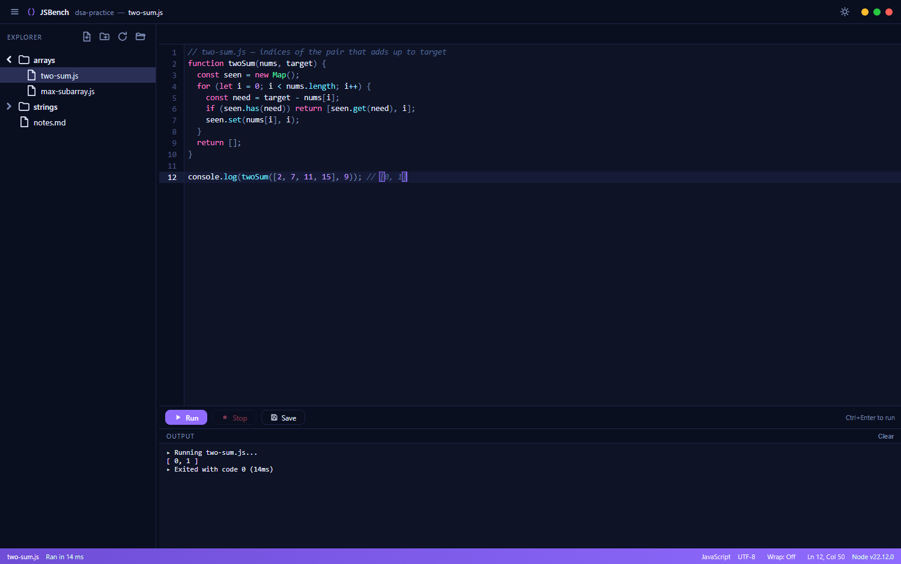

# JSBench — Lightweight JavaScript Editor & Runner

A fast, minimal Windows desktop app for writing and running JavaScript.
Tauri 2 + Rust + vanilla JS + CodeMirror 6, executed with your installed Node.js.

A small, open alternative to scratch-pad runners like RunJS — but with a real
local file/folder workspace instead of a single buffer.

 



## Features

- **CodeMirror 6 editor** — JS syntax highlighting, autocomplete, bracket
  matching, search, word wrap (`Alt+Z`), multi-tab with unsaved indicators
- **Aether look** — navy surfaces, synthwave syntax colours and an electric-violet
  accent; frameless window (native decorations off) filling the whole viewport,
  with a custom title bar carrying minimize / maximize / close dots on the right,
  plus breadcrumbs and a status bar
- **Themes** — Aether dark by default, plus a light theme toggled from the
  title bar; the choice is remembered between launches
- **Workspace file tree** — open any folder, create/rename/delete files and
  folders (including inside subfolders), collapse/expand directories
- **Instant run** — `Ctrl+Enter` executes the current file with Node.js;
  stdout/stderr stream live into the output panel
- **Format on save** — Prettier formats `.js` files as you save (toggle
  `Fmt` in the status bar); `Alt+Shift+F` formats on demand — a file with
  a syntax error is saved unformatted instead of failing
- **Process control** — Stop button kills the running process; 10s timeout
  guards against infinite loops
- **Persistence** — workspace, open tabs, active file, and window size/position
  are restored on launch
- **Portable** — single ~3.5 MB exe; config lives next to the binary when a
  `config/` folder is present, otherwise in `%APPDATA%\JSBench`

## Examples

JSBench is deliberately general — it runs any JavaScript you point it at.
A few things it is handy for:

- **DSA practice** — one folder per topic (`arrays/`, `strings/`, `graphs/`),
  work through problems file by file, and get `console.log` output instantly
  with `Ctrl+Enter`
- **Snippets and scratch pads** — check a function without spinning up a project
- **Learning and teaching** — a clean, distraction-free window for small demos
- **Quick data munging** — paste some JSON, transform it, look at the result

It is *not* a DSA-specific tool: there is no problem bank, judge, test runner or
algorithm visualiser. It is a small editor that runs code; how you organise the
folder is up to you.

## Development

Requires Node.js 18+, Rust (MSVC toolchain), and VS Build Tools.

```bash
npm install
npm run tauri dev
```

## Production build (NSIS installer + portable exe)

```bash
npm run tauri build
```

Outputs:
- `src-tauri/target/release/bundle/nsis/JSBench_<ver>_x64-setup.exe` — installer
- `src-tauri/target/release/jsbench.exe` — standalone binary for portable use

## Portable mode

Place `jsbench.exe` in a folder with an empty `config/` subfolder:

```
JSBench/
├── jsbench.exe
└── config/       ← app config is stored here
```

Without `config/`, config falls back to `%APPDATA%\JSBench`.

## Node.js

Detected from PATH. Override with the `JSBENCH_NODE_PATH` environment variable.

## Shortcuts

- `Ctrl+Enter` — Run current file
- `Ctrl+S` — Save
- `Ctrl+B` — Toggle the sidebar
- `Ctrl+J` — Clear the output panel
- `Ctrl+=` / `Ctrl++` — Increase font size
- `Ctrl+-` — Decrease font size
- `Ctrl+0` — Reset font size
- `Alt+Z` — Toggle word wrap
- `Alt+Shift+F` — Format document

## Project docs

- `docs/SPEC.md` — design spec and non-goals
- `CONTRIBUTING.md` — how to contribute

## License

MIT — see [LICENSE](LICENSE).
